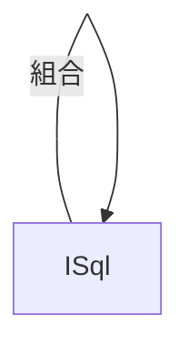

SQL 文字輔助工具

## 目的簡化撰寫Sql參數因複雜造成錯誤

### 變更紀錄

1.2023.01.06 基礎新增刪修建立
2.2023.01.07 加入min max distinct
3.2023.01.07 加入order by 與 where 條件

# 設計概念

select * from student where id in('Id1','Id2')

ISql為sql單位，ISql內組合ISql，無限制包覆，以方便組合方式更加自由



```java
Isql in  => SqlBuilder.quotationAndComma("id","id2");//'id','id2'
Isql cladIn=> SqlBuilder.clad(in);// ('id','id2')
```


### 常用元件

- ISql:sql定義介面
- SqlBuilder：產生括弧、逗點、單引號，等


提供insert delete update select 四種方式

### SELECT

```java


void test_select_cmd3() {

        String sql = SelectBuilder.newSelect().select("*")
                .from("XXX")
                .where(SqlBuilder.getParameter("value1", SqlOption.EQ, SqlBuilder.write(":value1")))
                .and(SqlBuilder.getParameter("value2", SqlOption.EQ, SqlBuilder.write(":value2")))//
                .back()//
                .orderBy()//
                .add(SqlBuilder.write("value1"))//
                .add(SqlBuilder.write("value2"))//
                .asc()
                .build().toUpperCase();
        log.info("sql:{}", sql);
        Assertions.assertEquals(sql, "select * from XXX where value1 = :value1 AND value2 = :value2 order by value1,value2 asc ".toUpperCase());

    }

```

### UPDATE

```java
    void test_1() {

        String sql = UpdateBuilder.update("STUDENT")
                .set(SqlBuilder.write("NAME"),SqlBuilder.quotation("小寶"))
                .back()
                .where(SqlBuilder.getParameter("id", SqlOption.EQ, SqlBuilder.quotation("B1234")))
                .build().toUpperCase();


        String ans = "update STUDENT set NAME = '小寶' where id = 'B1234'";

        log.info("sql:{}", sql);
        Assertions.assertEquals(sql, ans.toUpperCase());

    }
```

### DELETE

```java
    @Test
    void test_1() {

        String sql = DeleteBuilder.deleteFrom("student")
                .where(SqlBuilder.getParameter("id", SqlOption.EQ, SqlBuilder.quotation("AAAA")))
                .build().toUpperCase();


        String ans = "delete from student where id = 'AAAA'";

        log.info("sql:{}", sql);
        Assertions.assertEquals(sql, ans.toUpperCase());

    }
```

#### INSET

```java
    @Test
    void test(){
        String sql = InsertBuilder.insertTable("STUDENT")
                .add("ID", "'B1234'")
                .add("NAME", "'大寶'")
                .build().toUpperCase();
  
        String ans = "INSERT INTO STUDENT(ID,NAME) VALUES ('B1234','大寶')";

        log.info("sql:{}", sql);
        Assertions.assertEquals(sql, ans.toUpperCase());

    }
```
